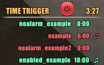

# Time Trigger
FFXI Windower Addon - Create triggers to run commands at a specific Vana'diel time(s).



```
Installation:
  1. Create a new folder called 'TimeTrigger' in the [../windower/addons], move all the downloaded files to your new folder. 
       You should end up with the following: [../windower/addons/TimeTrigger] with the addons folders and files within it: GUI,graphics,sounds,README.md,GUI.lua,TimeTrigger.lua
  2. In [../windower/addons/TimeTrigger], while hold CTRL, Click the 'GUI' folder AND 'GUI.lua' file and {CTRL + X} to cut.
  3. Navigate to the [../windower/addons/libs] folder and {CTRL + V} to paste it.
       You should end up with the following: [../windower/addons/libs/GUI]
```

  
- You can click the power icon to Enable/Disable the addon.

**Note: You can find additional settings within the characters config file (data/charname.xml) that don't have commands associated to them.**

#### LOADING / UNLOADING / RELOADING TIME TRIGGER
```
  //lua [load|l] TimeTrigger
  //lua [unload|u] TimeTrigger
  //lua [reload|r] TimeTrigger
```

#### WINDOW POSITIONING
```
[x] = Left and Right, [y] = Up and Down
tt [pos] <x> <y>
   //tt pos 800 100
tt [x] <num>
   //tt x 800
tt [y] <num>
   //tt y 100
```

#### ADDING TRIGGERS - Adds a new trigger
```
tt [time] [name] [cmd] {enabled(default: true)} {alert(default: false)}
 Examples:
  //tt 6:00 day_time "input /echo Good morning..."
  //tt 18:00 night_time "input /echo It\'s night time! Let\'s party!!" false
  //tt 3:00 Yawn "input /echo WAKE UP!!!" true true
```

#### EDITING TRIGGERS - Change a triggers setting
```
tt edit|e [name] time|cmd|enabled|alert [to]
 Examples:
  //tt edit my_trigger cmd "input /echo I'm doing something different now!"
  //tt edit night_time time 18:00
  //tt edit trigger_1 enabled false
  //tt edit trigger_1 alert true
  //tt edit multi_cmds cmd "input /echo ya....;wait 1;input /echo hooo!"
```

#### REMOVING TRIGGERS - Remove triggers
```
tt remove|r [name|all|a]
 Examples:
  //tt r my_trigger - removes the specified trigger
  //tt r all - removes all triggers
```

#### TOGGLING TRIGGERS - Change trigger(s) enabled state
```
tt toggle|t [name|all] {off}
 Examples:
  //tt toggle my_trigger - toggles specified triggers enabled state.
  //tt t all - enables all triggers.
  //tt t all off - disables all triggers.
```

#### START & STOP - Enables / Disables the addon
```
tt start|on|stop|off
```
  
#### LIST TRIGGERS - Lists all triggers and settings
```
tt list|l
```

#### SAVE - Saves all settings to {character}.xml
```
tt save
```
